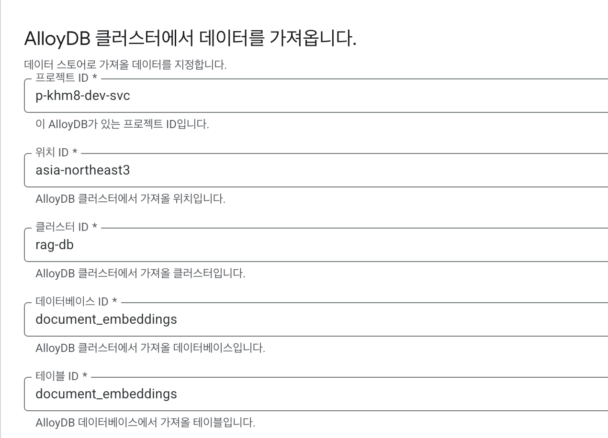
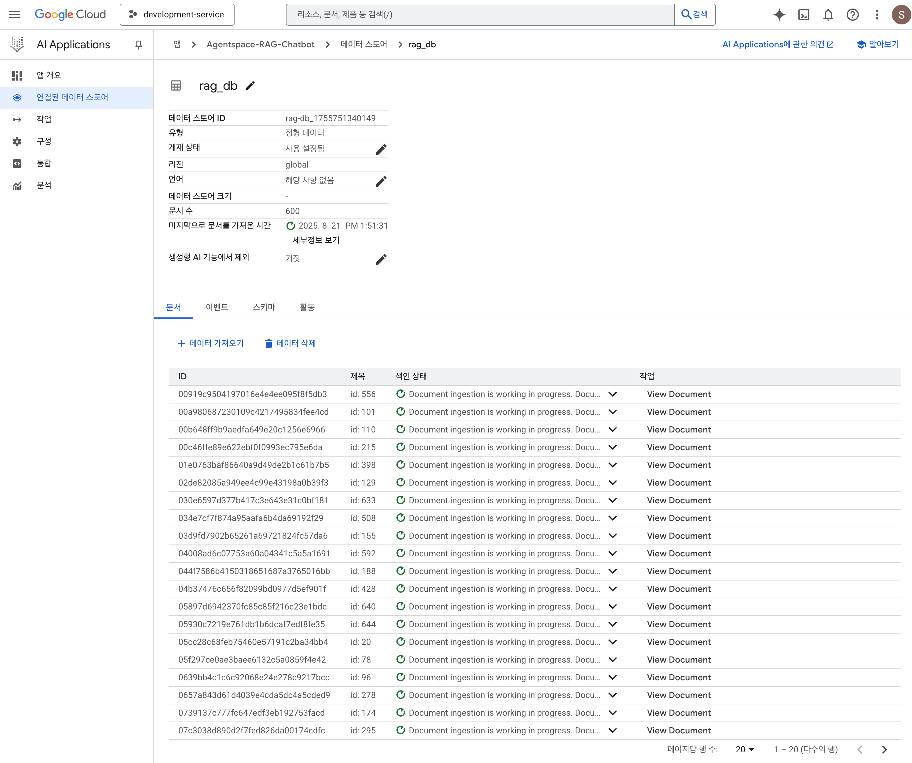

### **RAG PoC 아키텍처 구축 가이드**

본 문서는 Google Cloud Platform(GCP) 상에 RAG(Retrieval-Augmented Generation) 시스템 PoC를 구축하는 전체 과정을 안내합니다. 아키텍처는 데이터 수집, 처리, 임베딩, 서빙 및 평가 파이프라인으로 구성됩니다.

---

### **Phase 1: 환경 설정 및 사전 준비 (Setup & Prerequisites)**

가장 먼저 아키텍처에 필요한 Google Cloud 서비스들을 활성화하고, 데이터베이스와 스토리지, 통신 채널을 설정해야 합니다.

#### **1. Google Cloud API 활성화**

Cloud Shell 또는 로컬 터미널에서 다음 명령어를 실행하여 필요한 모든 API를 활성화합니다.

```bash
gcloud services enable \
    aiplatform.googleapis.com \
    run.googleapis.com \
    pubsub.googleapis.com \
    sqladmin.googleapis.com \
    alloydb.googleapis.com \
    storage.googleapis.com \
    cloudbuild.googleapis.com \
    logging.googleapis.com \
    monitoring.googleapis.com \
    bigquery.googleapis.com \
    dns.googleapis.com
```

#### **2. AlloyDB for PostgreSQL 설정**

벡터 데이터를 저장할 AlloyDB를 생성하고, 벡터 검색을 위한 `pgvector` 확장을 활성화합니다.

1.  **AlloyDB 클러스터 및 인스턴스 생성:**
    *   Cloud Console 또는 `gcloud`를 사용하여 클러스터와 기본 인스턴스를 생성합니다. 이때, **Private Service Connect(PSC)를 사용**하여 비공개 IP 연결을 설정합니다.

2.  **PSC 연결 수락 및 DNS 영역 설정:**
    *   AlloyDB 인스턴스의 '연결' 탭으로 이동하여 PSC 연결 요청을 **수락(Accept)**하고, 할당된 **DNS 이름**을 확인합니다.
    *   **[가장 중요]** Cloud Run에서 이 DNS 이름을 찾을 수 있도록, **반드시 PSC용 비공개 DNS 영역(Private DNS Zone)을 설정해야 합니다.** 이 단계가 누락되면 `Name or service not known` 오류가 발생합니다. 상세 과정은 [트러블슈팅](#q-cloud-run-로그에-name-or-service-not-known-또는-cant-create-a-connection-to-host-오류가-발생합니다)을 참조하세요.

3.  **데이터베이스 접속 및 생성:**
    *   AlloyDB는 VPC 내부에 있으므로, **동일한 VPC에 연결된 GCE VM**을 통해 접속해야 합니다.
    *   GCE VM에 SSH로 접속 후, `psql` 클라이언트를 사용하여 접속합니다.
        ```bash
        psql -h [PSC_DNS_NAME] -U postgres -d postgres
        ```
    *   접속 후, PoC에 사용할 데이터베이스를 생성합니다.
        ```sql
        CREATE DATABASE document_embeddings;
        ```

4.  **`pgvector` 확장 활성화 및 테이블 생성:**
    *   새로 만든 데이터베이스에 다시 접속(`\c document_embeddings`)한 후, 다음 SQL 쿼리를 실행합니다.
        ```sql
        CREATE EXTENSION IF NOT EXISTS vector;
        DROP TABLE IF EXISTS document_embeddings;

        CREATE TABLE document_embeddings (
            id SERIAL PRIMARY KEY,
            source_file VARCHAR(1024) NOT NULL,
            chunk_description TEXT,
            metadata JSONB,
            text_embedding VECTOR(768),       -- text-multilingual-embedding-002 모델 기준
            multimodal_embedding VECTOR(1408), -- multimodalembedding@001 모델 기준
            created_at TIMESTAMP WITH TIME ZONE DEFAULT CURRENT_TIMESTAMP
        );

        CREATE INDEX ON document_embeddings USING hnsw (text_embedding vector_l2_ops);
        CREATE INDEX ON document_embeddings USING hnsw (multimodal_embedding vector_l2_ops);
        ```

#### **3. GCS 버킷 생성**

아키텍처에 필요한 두 개의 버킷을 생성합니다.

1.  **원본 PDF 업로드용 버킷:**
    ```bash
    gsutil mb gs://original-pdfs-bucket-[PROJECT_ID]
    ```
2.  **파싱된 중간 데이터 저장용 버킷:**
    ```bash
    gsutil mb gs://parsed-json-bucket-[PROJECT_ID]
    ```

#### **4. Pub/Sub 토픽 및 알림 설정**

두 서비스 간의 통신을 위해 두 개의 Pub/Sub 토픽과 GCS 알림을 설정합니다.

1.  **Parser 서비스 트리거용 토픽 및 알림:**
    ```bash
    # 토픽 생성
    gcloud pubsub topics create pdf-upload-events

    # 원본 버킷 알림 설정
    gcloud storage buckets notifications create gs://original-pdfs-bucket-[PROJECT_ID] \
        --topic=pdf-upload-events \
        --event-types=OBJECT_FINALIZE
    ```
2.  **Embedder 서비스 트리거용 토픽 및 알림:**
    ```bash
    # 토픽 생성
    gcloud pubsub topics create parsed-json-events

    # 중간 데이터 버킷 알림 설정
    gcloud storage buckets notifications create gs://parsed-json-bucket-[PROJECT_ID] \
        --topic=parsed-json-events \
        --event-types=OBJECT_FINALIZE
    ```

---

### **Phase 2: 데이터 처리 파이프라인 (서비스 분리 아키텍처)**

초기 아키텍처는 라이브러리 의존성 충돌을 피하기 위해 두 서비스를 분리했습니다. 최종적으로는 두 서비스 모두 **Vertex AI SDK (`google-cloud-aiplatform`)**를 사용하도록 통일했지만, 각 서비스의 책임(Parsing vs. Embedding)을 명확히 분리하고 독립적으로 확장 및 관리할 수 있다는 점에서 서비스 분리 아키텍처의 장점은 여전히 유효합니다.

*   **`parser-service`**: PDF를 페이지별로 파싱하고, 이미지와 텍스트를 추출하여 Gemini를 통해 메타데이터를 생성합니다. Pub/Sub 재시도에 의한 **반복 실행을 방지**하는 로직이 포함되어 있습니다.
*   **`embedder-service`**: 파싱된 중간 데이터를 받아 **텍스트 임베딩(요약문 기반)**과 **이미지 임베딩(시각 정보 기반)**을 각각 생성하고, 최종 결과를 AlloyDB에 저장합니다. AlloyDB 연결 및 데이터 타입 관련 안정성 로직이 모두 적용되었습니다.

---

#### **2.1 Parser Service (`parser-service`)**

PDF를 파싱하고 Gemini 2.5 Pro를 통해 메타데이터를 추출한 후, 중간 결과물을 GCS에 저장합니다.

*   **프로젝트 구조:**
    ```
    rag_poc/
    └── parser-service/
        ├── main.py
        ├── requirements.txt
        ├── Dockerfile
        └── env.yaml
    ```

*   **`requirements.txt`**
    ```txt
    Flask>=2.0.0
    gunicorn>=20.0.0
    google-cloud-storage
    PyMuPDF>=1.23.0
    # 인증 및 API 호출에 필요한 라이브러리
    google-generativeai
    google-auth
    ```

*   **`Dockerfile`**
    ```dockerfile
    # ... (기존 Dockerfile 내용) ...
    
    # 빌드 검증 단계: Vertex AI SDK가 올바르게 설치되었는지 확인합니다.
    RUN python -c "import vertexai; print('Vertex AI SDK verification successful.')"
    
    # ... (CMD 명령어) ...
    ```

*   **`env.yaml`**
    ```yaml
    GCP_PROJECT: "[YOUR_PROJECT_ID]"
    REGION: "us-central1" # Gemini 2.5 Pro 사용 리전
    PARSED_BUCKET: "parsed-json-bucket-[PROJECT_ID]"
    ```

*   **`main.py` (핵심 `init_clients` 함수)**
    ```python
    import base64, json, os, sys, traceback
    from flask import Flask, request, jsonify
    import fitz # PyMuPDF
    from google.cloud import storage
    import vertexai
    from vertexai.generative_models import GenerativeModel, Part, GenerationConfig

    # --- 환경 변수 ---
    PROJECT_ID = os.environ.get("GCP_PROJECT")
    MODEL_LOCATION = os.environ.get("MODEL_LOCATION", "us-central1")
    PARSED_BUCKET_NAME = os.environ.get("PARSED_BUCKET")

    clients_initialized = False
    gemini_model = None
    storage_client = None

    SYSTEM_PROMPT = """
    You are an expert in analyzing documents and structuring them into JSON...
    """

    app = Flask(__name__)

    def init_clients():
        global clients_initialized, gemini_model, storage_client
        if clients_initialized: return

        print(f"Initializing clients with Vertex AI SDK...")
        try:
            vertexai.init(project=PROJECT_ID, location=MODEL_LOCATION)
            gemini_model = GenerativeModel("gemini-2.5-pro", system_instruction=SYSTEM_PROMPT)
            storage_client = storage.Client(project=PROJECT_ID)
            clients_initialized = True
            print("Vertex AI SDK clients initialized successfully.")
        except Exception as e:
            print(f"CRITICAL: Failed to initialize clients. Error: {e}", file=sys.stderr)
            traceback.print_exc(); raise

    @app.route("/", methods=["POST"])
    def process_upload_event():
        try:
            init_clients()
            
            # ... (Pub/Sub 메시지 파싱) ...
            decoded_data = base64.b64decode(request.json["message"]["data"]).decode("utf-8")
            message_json = json.loads(decoded_data)
            bucket_name = message_json.get("bucket")
            file_name = message_json.get("name")

            # 1. 멱등성 확인 (반복 처리 방지)
            destination_bucket = storage_client.bucket(PARSED_BUCKET_NAME)
            prefix = f"{file_name.replace('.pdf', '')}-page-"
            if next(destination_bucket.list_blobs(prefix=prefix, max_results=1), None):
                print(f"File '{file_name}' has already been processed. Skipping.")
                return "OK", 204

            print(f"Processing file: gs://{bucket_name}/{file_name}")
            source_bucket = storage_client.bucket(bucket_name)
            pdf_blob = source_bucket.blob(file_name)
            pdf_document = fitz.open(stream=pdf_blob.download_as_bytes())

            for i, page in enumerate(pdf_document):
                page_num = i + 1
                page_text = page.get_text().strip()
                image_bytes = page.get_pixmap(dpi=150).tobytes("png")

                print(f"  - Processing page {page_num}...")
                
                # 2. Crash 방지: 텍스트 없는 페이지 처리
                page_text_for_gemini = page_text if page_text else "(No text content found on this page)"
                
                image_part = Part.from_data(data=image_bytes, mime_type="image/png")
                response = gemini_model.generate_content(
                    [image_part, page_text_for_gemini],
                    generation_config=GenerationConfig(response_mime_type="application/json")
                )
                
                intermediate_data = {
                    "source_file": f"gs://{bucket_name}/{file_name}",
                    "page_num": page_num,
                    "page_text": page_text, # 원본 텍스트는 그대로 저장
                    "image_base64": base64.b64encode(image_bytes).decode('utf-8'),
                    "metadata": json.loads(response.text)
                }

                new_blob_name = f"{prefix}{page_num}.json"
                destination_bucket.blob(new_blob_name).upload_from_string(
                    json.dumps(intermediate_data, ensure_ascii=False),
                    content_type="application/json"
                )
                print(f"  - Saved intermediate data to gs://{PARSED_BUCKET_NAME}/{new_blob_name}")

            pdf_document.close()
            print(f"Successfully processed {file_name}")
            return "OK", 200
        except Exception as e:
            print(f"Error processing upload event: {e}", file=sys.stderr)
            traceback.print_exc()
            return "Internal Server Error", 500
    ```

*   **배포 (`parser-service` 디렉토리에서 실행):**
    ```bash
    gcloud run deploy parser-service \
        --source . \
        --region asia-northeast3 \
        --allow-unauthenticated \
        --vpc-connector [VPC_CONNECTOR] \
        --vpc-egress=all-traffic \
        --env-vars-file=env.yaml \
        --service-account [SERVICE_ACCOUNT_EMAIL] \
        --memory=2Gi \
        --timeout=600
    ```

*   **Pub/Sub 구독 생성:**
    ```bash
    gcloud pubsub subscriptions create pdf-upload-subscription \
        --topic pdf-upload-events \
        --push-endpoint=$(gcloud run services describe parser-service --platform managed --region asia-northeast3 --format "value(status.url)") \
        --push-auth-service-account=[CLOUD_RUN_INVOKER_SA]
    ```

---

#### **2.2 Embedder Service (`embedder-service`)**

`parser-service`가 생성한 중간 JSON 파일을 입력받아, **요약문 기반 텍스트 임베딩**과 **순수 이미지 기반 멀티모달 임베딩**을 생성하고 AlloyDB에 최종 저장합니다.

*   **프로젝트 구조:**
    ```
    rag_poc/
    └── embedder-service/
        ├── main.py
        ├── requirements.txt
        ├── Dockerfile
        └── env.yaml
    ```

*   **`requirements.txt`**
    ```txt
    Flask>=2.0.0
    gunicorn>=20.0.0
    google-cloud-storage
    pg8000>=1.29.0
    # GCP 네이티브 라이브러리만 사용합니다.
    google-cloud-aiplatform[generative_ai]
    ```
*   **`Dockerfile`**
    ```dockerfile
    # ... (기존 Dockerfile 내용) ...
    
    # 빌드 검증 단계: Vertex AI SDK가 올바르게 설치되었는지 확인합니다.
    RUN python -c "import vertexai; print('Vertex AI SDK verification successful.')"
    
    # ... (CMD 명령어) ...
    ```

*   **`env.yaml`**
    ```yaml
    GCP_PROJECT: "[YOUR_PROJECT_ID]"
    EMBEDDING_REGION: "asia-northeast3" # 임베딩 모델 사용 리전
    DB_HOST: "[PSC_DNS_NAME]"
    DB_USER: "postgres"
    DB_PASS: "[YOUR_DB_PASSWORD]"
    DB_NAME: "document_embeddings"
    ```

*   **`main.py` (핵심 `init_clients` 함수)**
    ```python
    import base64, json, os, ssl, sys, traceback
    from flask import Flask, request
    import pg8000.dbapi
    from google.cloud import storage
    import vertexai
    from vertexai.language_models import TextEmbeddingModel
    from vertexai.vision_models import Image as VisionImage, MultiModalEmbeddingModel

    # ... (환경 변수 및 전역 변수 설정) ...

    app = Flask(__name__)

    def init_clients():
        # ... (이전과 동일) ...

    def get_db_connection():
        """AlloyDB 데이터베이스에 대한 보안 연결을 생성합니다."""
        print("Connecting to AlloyDB...")
        try:
            # 1. SSL 인증서 검증 비활성화 (VPC 내부 통신용)
            ssl_context = ssl.SSLContext()
            ssl_context.verify_mode = ssl.CERT_NONE
            ssl_context.check_hostname = False
            
            conn = pg8000.dbapi.connect(
                host=DB_HOST, port=5432, user=DB_USER, password=DB_PASS, database=DB_NAME, ssl_context=ssl_context
            )
            print("AlloyDB connection successful.")
            return conn
        except Exception as e:
            print(f"CRITICAL: Failed to connect to AlloyDB. Error: {e}", file=sys.stderr)
            traceback.print_exc(); raise

    @app.route("/", methods=["POST"])
    def process_parsed_event():
        # ... (Pub/Sub 메시지 파싱) ...
        
        try:
            init_clients()
            # ... (GCS에서 JSON 파일 다운로드) ...

            summary = intermediate_data["metadata"]["summary"]
            image_bytes = base64.b64decode(intermediate_data["image_base64"])

            print("  - Generating text embedding for summary...")
            text_embeddings = text_embedding_model.get_embeddings([summary])
            
            print("  - Generating multimodal embedding for image only...")
            # 2. 순수 이미지 임베딩 생성 (텍스트 제외)
            multimodal_embeddings = multimodal_embedding_model.get_embeddings(
                image=VisionImage(image_bytes=image_bytes)
            )

            insert_data = (
                intermediate_data["source_file"],
                f"Content from page {intermediate_data['page_num']} of file {os.path.basename(intermediate_data['source_file'])}",
                json.dumps(intermediate_data["metadata"], ensure_ascii=False),
                # 3. pgvector 형식에 맞게 JSON 문자열로 변환
                json.dumps(text_embeddings[0].values),
                json.dumps(multimodal_embeddings.image_embedding) # 단일 이미지 결과는 .image_embedding 사용
            )

            print(f"  - Inserting record into AlloyDB...")
            conn = None
            cursor = None
            try:
                conn = get_db_connection()
                cursor = conn.cursor()
                # 4. SQL 쿼리에 명시적 타입 캐스팅(::vector) 추가
                cursor.execute(
                    """INSERT INTO document_embeddings
                       (source_file, chunk_description, metadata, text_embedding, multimodal_embedding)
                       VALUES (%s, %s, %s, %s::vector, %s::vector)""",
                    insert_data
                )
                conn.commit()
            finally:
                # 5. 안정적인 DB 커서 및 연결 해제
                if cursor: cursor.close()
                if conn: conn.close()

            print(f"Successfully processed and inserted data for gs://{bucket_name}/{file_name}.")
            return "OK", 204
        except Exception as e:
            print(f"CRITICAL: Failed to process file {file_name}. Error: {e}", file=sys.stderr)
            traceback.print_exc()
            return "Internal Server Error", 500
    ```

*   **배포 (`embedder-service` 디렉토리에서 실행):**
    ```bash
    gcloud run deploy embedder-service \
        --source . \
        --region asia-northeast3 \
        --allow-unauthenticated \
        --vpc-connector [VPC_CONNECTOR] \
        --vpc-egress=all-traffic \
        --env-vars-file=env.yaml \
        --service-account [SERVICE_ACCOUNT_EMAIL] \
        --memory=2Gi \
        --timeout=600
    ```
*   **Pub/Sub 구독 생성:**
    ```bash
    gcloud pubsub subscriptions create parsed-json-subscription \
        --topic parsed-json-events \
        --push-endpoint=$(gcloud run services describe embedder-service --platform managed --region asia-northeast3 --format "value(status.url)") \
        --push-auth-service-account=[CLOUD_RUN_INVOKER_SA]
    ```

---

### **Phase 3: 백필(Backfill) 및 재처리 테스트**

`file-processor-service`의 코드를 수정했거나, 특정 파일 처리가 누락/실패했을 때, GCS에 파일을 다시 업로드하지 않고도 기존 파일들을 재처리할 수 있습니다. `backfill.py` 스크립트는 GCS 버킷의 특정 폴더에 있는 모든 파일 목록을 읽어, 각 파일에 대해 GCS 업로드 이벤트(Pub/Sub 메시지)를 수동으로 생성하여 파이프라인을 트리거합니다.

이 과정은 로컬 PC 또는 Cloud Shell에서 Python 가상 환경을 설정하여 안전하게 실행합니다.

#### **1. 백필 스크립트 준비 (`backfill.py`)**

먼저 `~/rag_chatbot/backfill/` 디렉토리에 필요한 파일들이 있는지 확인합니다.

**`requirements.txt`**
이 디렉토리에는 Python 라이브러리 의존성을 정의한 `requirements.txt` 파일이 있어야 합니다.

```txt
google-cloud-storage
google-cloud-pubsub
```

**`backfill.py`**
스크립트는 GCS와 Pub/Sub 클라이언트를 사용하여 메시지를 발행하는 로직을 포함해야 합니다. (아래는 기능 이해를 돕기 위한 예시 코드)

```python
import argparse
import json
from google.cloud import storage, pubsub_v1

def trigger_gcs_events(project_id, topic_id, gcs_bucket, gcs_prefix):
    """Lists files in GCS and publishes a Pub/Sub message for each."""
    
    storage_client = storage.Client(project=project_id)
    publisher = pubsub_v1.PublisherClient()
    topic_path = publisher.topic_path(project_id, topic_id)

    blobs = storage_client.list_blobs(gcs_bucket, prefix=gcs_prefix)
    
    print(f"Found files in gs://{gcs_bucket}/{gcs_prefix}. Publishing events to topic '{topic_id}'...")
    
    for blob in blobs:
        # GCS OBJECT_FINALIZE 이벤트와 유사한 메시지 구조 생성
        message_data = {
            "bucket": gcs_bucket,
            "name": blob.name
        }
        
        # 데이터를 JSON 문자열로 변환 후, 바이트로 인코딩
        message_bytes = json.dumps(message_data).encode("utf-8")
        
        future = publisher.publish(topic_path, data=message_bytes)
        print(f"Published message for gs://{gcs_bucket}/{blob.name}, message_id: {future.result()}")

    print("Backfill process completed.")

if __name__ == "__main__":
    parser = argparse.ArgumentParser(description="GCS backfill script for Pub/Sub.")
    parser.add_argument("--project_id", required=True, help="Your Google Cloud project ID.")
    parser.add_argument("--topic_id", required=True, help="The Pub/Sub topic ID to publish to.")
    parser.add_argument("--gcs_bucket", required=True, help="The GCS bucket name.")
    parser.add_argument("--gcs_prefix", default="", help="Optional GCS path prefix to filter files.")
    
    args = parser.parse_args()
    
    trigger_gcs_events(args.project_id, args.topic_id, args.gcs_bucket, args.gcs_prefix)
```

#### **2. 로컬/Cloud Shell 환경 설정 및 실행**

1.  **디렉토리 이동:**
    Cloud Shell 또는 로컬 터미널에서 `backfill.py`가 있는 곳으로 이동합니다.
    ```bash
    cd ~/rag_chatbot/backfill
    ```

2.  **Python 가상 환경 생성 및 활성화:**
    프로젝트별로 독립된 라이브러리 환경을 사용하기 위해 가상 환경을 생성합니다.
    ```bash
    # 가상 환경 'venv' 생성
    python3 -m venv venv

    # 가상 환경 활성화 (터미널 프롬프트 앞에 '(venv)'가 나타남)
    source venv/bin/activate
    ```

3.  **필요 라이브러리 설치:**
    가상 환경이 **반드시 활성화된 상태**에서 `requirements.txt` 파일로 라이브러리를 설치합니다.
    ```bash
    pip install -r requirements.txt
    ```

4.  **GCP 인증:**
    스크립트가 GCP 서비스(GCS, Pub/Sub)에 접근할 수 있도록 로컬 환경에서 사용자 계정으로 인증합니다.
    ```bash
    gcloud auth application-default login
    ```
    이 명령어는 웹 브라우저를 열어 Google 계정으로 로그인하도록 요청하며, 인증 정보를 로컬에 저장합니다.

5.  **백필 스크립트 실행:**
    이제 모든 준비가 끝났습니다. 아래 명령어를 실행하여 백필을 시작합니다. `[PLACEHOLDER]` 부분들을 실제 값으로 변경하세요.
    `backfill.py` 스크립트는 **원본 PDF가 있는 GCS 버킷**을 대상으로 실행하여, 전체 파이프라인을 처음부터 다시 트리거합니다.

    `backfill.py` 스크립트 실행 명령어:
    ```bash
    python backfill.py \
        --project_id [YOUR_PROJECT_ID] \
        --gcs_bucket original-pdfs-bucket-[PROJECT_ID] \
        --gcs_prefix pdfs/ \
        --topic_id pdf-upload-events
    ```

#### **3. 결과 모니터링**

스크립트가 실행되면 터미널에 각 파일에 대한 메시지 발행 로그가 출력됩니다. 이와 동시에, **Cloud Run 콘솔의 로그 탐색기**로 이동하여 `file-processor-service`의 로그를 확인하세요. GCS의 각 파일에 대해 서비스가 순차적으로 트리거되며 처리 로그가 나타나는 것을 볼 수 있습니다. 이를 통해 전체 데이터 처리 파이프라인이 정상적으로 작동하는지 검증할 수 있습니다.

#### **4. 가상 환경 비활성화**

테스트가 끝나면 아래 명령어로 가상 환경을 빠져나옵니다.
```bash
deactivate
```

---

### **Phase 4: 서빙 서브시스템 (Serving Subsystem)**

이제 AlloyDB에 저장된 벡터 데이터를 활용하여 사용자 질문에 답변하는 챗봇 에이전트를 구성합니다. 다이어그램의 `Google AgentSpace`는 **Vertex AI Agent Builder** (과거 Gen App Builder)를 의미하는 것으로 보입니다.

1.  **Vertex AI Agent Builder에서 앱 생성:**
    *   [Vertex AI Agent Builder 콘솔](https://console.cloud.google.com/gen-app-builder)로 이동합니다.
    *   콘솔 화면 좌측 상단의 `앱 만들기` 링크를 클릭합니다.
    *   Agentspace의 `만들기`를 클릭합니다.
    *   앱 이름은 `Agentspace-RAG-Chatbot`로 하고 위치는 `global (전역)`을 선택한 후 `만들기 버튼을 클릭합니다.
    *   생성된 `Agentspace-RAG-Chatbot`을 클릭한 후 `데이터 스토어 만들기`를 클릭합니다.
2.  **데이터 저장소(Data Store) 구성:**
    *   데이터 소스로 **'AlloyDB'**를 선택합니다.
    *   DB 연결 정보를 입력합니다: 프로젝트 ID, 인스턴스 ID, 데이터베이스 이름, 테이블 이름(`document_embeddings`), 사용자 인증 정보 등을 아래 이미지처럼 입력하고 계속 버튼을 클릭합니다.
        
    *   구성에서는 **데이터 스토어 이름**에 `rag_db`를 입력한 후 `만들기`를 클릭합니다.
    *   연결된 데이터 스토어에서 `rag_db`를 클릭한 후 데이터 가져오기 상태를 확인합니다. 
        
3.  **에이전트 테스트:**
    *   콘솔 좌측 상단의 `앱 개요`를 선택하면 Agentspace 웹 앱에 대한 정보가 보입니다. Agentspace 라이선스 구매 후 Agentspace 웹 앱 URL을 복사하여 다른 브라우저 탭에서 열면 Agentspace가 구동되는 것을 확인할 수 있습니다. 
    *   에이전트는 사용자의 질문을 자동으로 임베딩하고, AlloyDB에서 벡터 검색(Semantic Search)을 수행하여 가장 관련성 높은 `content`를 찾은 후, Gemini 모델을 사용하여 최종 답변을 생성합니다.

---

### **Phase 5: 품질 평가 서브시스템 (Quality Evaluation)**

이 시스템은 생성된 답변의 품질을 자동으로 평가하고 결과를 BigQuery에 저장하는 역할을 합니다.

#### **1. 평가용 Cloud Run Job 코드**

이 코드는 평가 데이터셋(질문-정답 쌍)을 기반으로 서빙 에이전트에 질문을 던지고, 그 답변을 평가 모델(예: Gemini)을 사용해 채점합니다.

**`evaluator_job.py` (예시)**

```python
# (필요한 라이브러리 import)
# ...

def get_evaluation_dataset():
    # 평가용 질문-정답 쌍을 가져옵니다. (예: GCS 파일, BigQuery 등)
    return [
        {"question": "이 문서의 주요 내용은 무엇인가요?", "golden_answer": "이 문서는 AI 아키텍처에 대한 설명입니다."},
        # ...
    ]

def query_serving_agent(question):
    # Vertex AI Agent Builder SDK 또는 API를 사용하여 질문을 보내고 답변을 받습니다.
    # 이 부분은 Agent Builder API 문서를 참고하여 구현해야 합니다.
    # response = agent.search(question)
    # return response.answer
    return "에이전트로부터 받은 답변 예시" # Placeholder

def evaluate_response(question, generated_answer, golden_answer):
    # Gemini를 평가 모델로 사용하여 답변 품질을 채점합니다.
    evaluator_model = GenerativeModel("gemini-1.5-pro-001")
    prompt = f"""
    Question: {question}
    Golden Answer: {golden_answer}
    Generated Answer: {generated_answer}

    'Generated Answer'가 'Golden Answer'와 얼마나 일치하고 질문에 대해 정확한지 1~5점 척도로 평가하고, 그 이유를 간략히 설명해주세요.
    반드시 아래 JSON 형식으로만 답변해주세요.

    {{
      "score": <1에서 5 사이의 정수>,
      "reason": "<평가 이유>"
    }}
    """
    response = evaluator_model.generate_content(prompt, generation_config={"response_mime_type": "application/json"})
    return json.loads(response.text)

def save_to_bigquery(results):
    # 평가 결과를 BigQuery 테이블에 저장합니다.
    # bq_client = bigquery.Client()
    # bq_client.insert_rows_json(...)
    print("Saving results to BigQuery:", results) # Placeholder

def main():
    evaluation_set = get_evaluation_dataset()
    evaluation_results = []

    for item in evaluation_set:
        question = item["question"]
        golden_answer = item["golden_answer"]
        
        generated_answer = query_serving_agent(question)
        evaluation = evaluate_response(question, generated_answer, golden_answer)
        
        result_row = {
            "prompt": question,
            "response": generated_answer,
            "evaluation_score": evaluation["score"],
            "evaluation_reason": evaluation["reason"]
        }
        evaluation_results.append(result_row)

    save_to_bigquery(evaluation_results)

if __name__ == "__main__":
    main()
```

#### **2. BigQuery 테이블 생성**

평가 결과를 저장할 테이블을 미리 생성합니다.

```sql
CREATE OR REPLACE TABLE `[YOUR_PROJECT_ID].[YOUR_DATASET_ID].evaluation_results` (
    prompt STRING OPTIONS(description="에이전트에게 보낸 질문 또는 프롬프트"),
    response STRING OPTIONS(description="에이전트가 생성한 답변"),
    evaluation_score INT64 OPTIONS(description="자동 평가 모델이 채점한 점수"),
    evaluation_reason STRING OPTIONS(description="점수에 대한 평가 근거"),
    timestamp TIMESTAMP DEFAULT CURRENT_TIMESTAMP()
);
);
```

#### **3. 평가 실행**

*   **Cloud Run Job으로 배포:** 위 코드를 Job 형태로 배포하여 필요할 때마다 실행할 수 있습니다.
*   **Trigger 설정:** Cloud Scheduler와 Pub/Sub을 사용하여 정기적으로(예: 매일 밤) 평가 작업을 트리거하도록 구성할 수 있습니다.

---

### **트러블슈팅 (Troubleshooting)**

#### Q: GCE VM에서 AlloyDB로 `psql` 접속이 안 됩니다 (I/O Timeout 등).

**A:** 이것은 대부분 PSC 연결 문제입니다. 아래 순서대로 확인하세요.
1.  **PSC 엔드포인트 상태 확인:** AlloyDB 인스턴스의 '연결' 탭에서 PSC 엔드포인트 상태가 `✅ 수락됨`이고, 내부 IP가 할당되었는지 확인하세요. `⚠️ 확인 필요` 상태라면 다음 단계를 진행하세요.
2.  **Service Connection Policy 확인:** `확인 필요` 상태의 원인은 조직의 보안 정책(`ServiceConnectionPolicy`)이 연결을 막고 있기 때문입니다. 조직 관리자 권한으로 아래 명령어를 실행하여 `dev-vpc` 네트워크가 `alloydb.googleapis.com` 서비스에 접속할 수 있도록 허용하는 정책을 생성해야 합니다.
    ```bash
    gcloud network-connectivity service-connection-policies create allow-alloydb-for-dev-vpc \
        --service-class=alloydb.googleapis.com \
        --network=projects/[YOUR_PROJECT_ID]/global/networks/dev-vpc \
        --consumer-resource-roots=projects/[YOUR_PROJECT_ID] \
        --location=global \
        --project=[YOUR_PROJECT_ID]
    ```
3.  **정책 생성 후 연결 수락:** 위 명령어가 성공하면, 다시 AlloyDB 콘솔로 돌아가 PSC 연결 요청을 **수락**합니다.
4.  **DNS 이름으로 접속:** 반드시 할당된 IP가 아닌, 긴 **DNS 이름**을 사용하여 `psql -h [PSC_DNS_NAME] ...` 명령으로 접속해야 합니다.

#### Q: GCE VM에 SSH 접속이 안 됩니다 (웹 브라우저, gcloud 모두 먹통).

**A:** VPC의 방화벽 문제일 가능성이 99%입니다.
1.  **SSH 허용 방화벽 규칙 생성:** Cloud Shell에서 아래 명령어를 실행하여 인터넷에서 VM으로의 SSH(TCP 포트 22) 접속을 허용하는 방화벽 규칙을 생성합니다. `[VPC_NETWORK_NAME]`을 `dev-vpc` 등으로 변경하세요.
    ```bash
    gcloud compute firewall-rules create default-allow-ssh \
        --network=[VPC_NETWORK_NAME] \
        --allow=tcp:22 \
        --source-ranges=0.0.0.0/0
    ```
2.  **외부 IP 확인:** VM에 외부 IP가 할당되어 있는지 확인하세요. 없다면 VM을 수정하여 임시 외부 IP를 할당해야 합니다.

#### Q: `gcloud run deploy` 실행 시 VPC 커넥터 오류가 발생합니다.

**A:** 오류 메시지가 `VPC connector ... does not exist, or Cloud Run does not have permission to use it` 라면, 권한 문제입니다.
1.  **커넥터 존재 확인:** `gcloud compute networks vpc-access connectors list --region asia-northeast3` 명령으로 커넥터가 `READY` 상태로 존재하는지 먼저 확인합니다.
2.  **두 서비스 계정에 권한 부여:** **두 개의** 서비스 계정에 `roles/vpcaccess.user` 역할을 부여해야 합니다.
    *   **사용자 지정 서비스 계정:**
        ```bash
        gcloud projects add-iam-policy-binding [YOUR_PROJECT_ID] \
            --member="serviceAccount:[SERVICE_ACCOUNT_EMAIL]" \
            --role="roles/vpcaccess.user"
        ```
    *   **Cloud Run 서비스 에이전트 (Google 관리):**
        ```bash
        gcloud projects add-iam-policy-binding [YOUR_PROJECT_ID] \
            --member="serviceAccount:service-[YOUR_PROJECT_NUMBER]@serverless-robot-prod.iam.gserviceaccount.com" \
            --role="roles/vpcaccess.user"
        ```

#### Q: `gcloud run deploy` 실행 중 `gcloud crashed (TypeError)` 오류가 발생합니다.

**A:** `gcloud` 도구 자체의 문제 또는 빌드 환경의 네트워크 문제입니다.
1.  **`gcloud` 업데이트:** `gcloud components update`를 실행하여 도구를 최신화합니다.
2.  **`env.yaml` 사용:** 명령어에 직접 환경 변수를 주입하는 대신, 본문에 안내된 `env.yaml` 파일을 사용하는 `--env-vars-from-file` 방식으로 변경하세요. 이 방법이 훨씬 안정적입니다.
3.  **Cloud Build 권한 확인:** IAM 페이지에서 `[PROJECT_NUMBER]@cloudbuild.gserviceaccount.com` 서비스 계정에 `Cloud Run 관리자` 및 `서비스 계정 사용자` 역할이 있는지 확인하세요.

#### Q: Cloud Run 로그에 `Name or service not known` 또는 `Can't create a connection to host` 오류가 발생합니다.

**A:** Cloud Run이 AlloyDB의 PSC DNS 주소를 IP로 변환하지 못하는, 전형적인 **비공개 DNS 조회 문제**입니다.
1.  **가장 먼저 [Phase 1의 3단계](#3-가장-중요-psc용-비공개-dns-영역private-dns-zone-설정)를 수행했는지 확인하세요.** `goog` DNS 이름으로 비공개 DNS 영역을 만들고, VPC 네트워크에 연결한 후, PSC의 전체 DNS 이름과 IP 주소로 A 레코드를 추가해야 합니다.
2.  Cloud DNS API(`dns.googleapis.com`)가 활성화되어 있는지 확인하세요.

#### Q: Cloud Run 로그에 `404 Not Found ... models/gemini-2.5-pro` 오류가 발생합니다.

**A:** API를 호출한 리전(`asia-northeast3`)에 해당 모델이 없기 때문입니다.
1.  `main.py`의 `init_clients` 함수에서 `vertexai.init(location="global")`로 설정하여 **글로벌 엔드포인트**를 사용하도록 수정하세요.

#### Q: `gcloud run deploy` 실행 시 VPC 커넥터 오류가 발생합니다.

**A:** 오류 메시지가 `VPC connector ... does not exist, or Cloud Run does not have permission to use it` 라면, 권한 문제입니다.
1.  **두 개의** 서비스 계정에 `roles/vpcaccess.user` 역할을 부여해야 합니다.
    *   **배포에 사용한 서비스 계정:** `[SERVICE_ACCOUNT_EMAIL]`
    *   **Cloud Run 서비스 에이전트:** `service-[YOUR_PROJECT_NUMBER]@serverless-robot-prod.iam.gserviceaccount.com`

#### Q: Cloud Run 로그에 `404 Not Found ... Publisher Model ... is not found` 오류가 발생합니다.

**A:** API를 호출한 엔드포인트에 해당 모델이 존재하지 않기 때문입니다. 이는 **모든 모델이 동일한 리전(`asia-northeast3`)이나 `global` 엔드포인트에 있지 않기 때문**에 발생합니다.
1.  **해결책:** `main.py`의 `init_clients` 함수에서, 각 모델을 생성할 때 `client_options`를 사용하여 올바른 API 엔드포인트를 명시적으로 지정해야 합니다.
2.  **예시:**
    *   `gemini-2.5-pro` -> `api_endpoint="us-central1-aiplatform.googleapis.com"`
    *   `text-multilingual-embedding-002` -> `api_endpoint="asia-northeast3-aiplatform.googleapis.com"`
3.  자세한 코드는 **[Phase 2의 1단계](#1-cloud-run-서비스-코드-준비-최종-아키텍처-반영)**를 참조하세요.

#### Q: Cloud Run 로그에 `Initializing Vertex AI for project 'None'...`가 보이며, 이후 404 오류가 발생합니다.

**A:** Cloud Run 환경에 `GCP_PROJECT` 환경 변수가 설정되지 않아 SDK가 어떤 프로젝트로 API를 호출해야 할지 모르기 때문입니다.
1.  **해결책:** `env.yaml` 파일에 `GCP_PROJECT: "[YOUR_PROJECT_ID]"` 한 줄을 **반드시 추가**한 후, 다시 배포하세요.

#### Q: Cloud Run 로그에 `Name or service not known` 또는 `Can't create a connection to host` 오류가 발생합니다.

**A:** Cloud Run이 AlloyDB의 PSC DNS 주소를 IP로 변환하지 못하는, 전형적인 **비공개 DNS 조회 문제**입니다.
1.  **해결책:** **[Phase 1의 2단계](#2-alloydb-for-postgresql-설정)**에 있는 **PSC용 비공개 DNS 영역 설정** 가이드를 다시 한번 꼼꼼히 확인하고 그대로 실행하세요. `goog` DNS 이름으로 비공개 영역을 만들고 VPC에 연결한 후, A 레코드를 추가해야 합니다.

#### Q: `gcloud run deploy` 실행 중 빌드 단계에서 `ModuleNotFoundError`가 발생합니다.

**A:** `Dockerfile` 내부의 검증 단계(`RUN python -c "import ..."`)가 `requirements.txt`에 명시된 라이브러리와 일치하지 않기 때문입니다.
*   **`parser-service`**의 `Dockerfile`은 `import google.generativeai`를 검증해야 합니다.
*   **`embedder-service`**의 `Dockerfile`은 `import vertexai`를 검증해야 합니다.
*   각 서비스에 맞는 라이브러리를 검증하도록 `Dockerfile`을 수정하세요.

#### Q: Cloud Run 로그에 `ACCESS_TOKEN_SCOPE_INSUFFICIENT` 또는 `PermissionDenied`가 발생합니다.

**A:** 이 문제는 범용 라이브러리(`google-generativeai`)를 사용하여 Cloud Run 서비스 리전과 다른 리전의 API(예: 서울 -> us-central1)를 호출할 때 발생합니다. 라이브러리가 API 요청에 대한 **비용/할당량 책임 프로젝트(Quota Project)를 지정하지 못하기 때문**입니다.
1.  **해결책:** `parser-service`의 `main.py`와 같이, `genai.configure()` 함수에 `client_options={"quota_project_id": "YOUR_PROJECT_ID"}`를 명시적으로 전달해야 합니다.
2.  **참고:** `google-cloud-aiplatform` SDK는 GCP 환경에 최적화되어 있어 이 문제가 거의 발생하지 않습니다.

#### Q: 왜 파서(parser)와 임베더(embedder) 서비스를 분리해야 하나요?

**A: 이것이 이 아키텍처의 가장 핵심적인 결정입니다.** `google-cloud-aiplatform` 라이브러리의 최신 버전은, 새로운 `google-generativeai` 라이브러리를 필수 의존성으로 포함합니다. 이로 인해 두 라이브러리가 하나의 환경에 함께 설치되면 **네임스페이스 충돌**이 발생하여, `google.cloud.aiplatform.language_models` 와 같은 예전 모듈 경로를 찾지 못하는 `ModuleNotFoundError`가 발생할 수 있습니다. **두 서비스의 책임을 명확히 분리하고 각각 필요한 라이브러리만 독립적으로 설치하는 것이 이 문제를 해결하는 가장 근본적이고 올바른 방법입니다.**

#### Q: Parser Service가 동일한 파일을 계속 반복해서 처리합니다 (무한 루프).

**A:** 두 가지 원인이 복합적으로 작용한 문제입니다.
1.  **원인 1 (Crash):** PDF 페이지 중 텍스트가 전혀 없는 경우(`''`), 이를 그대로 Gemini API로 보내면 `InvalidArgument` 오류가 발생하여 서비스가 비정상 종료됩니다.
2.  **원인 2 (Pub/Sub 재시도):** 서비스가 성공 응답(HTTP 2xx)을 보내지 못하면, Pub/Sub은 처리가 실패했다고 간주하고 동일한 메시지를 계속 재전송합니다.
3.  **해결책:** `parser-service`의 `main.py`에 두 가지 로직을 모두 적용해야 합니다.
    *   **멱등성(Idempotency) 확보:** GCS의 `parsed-json-bucket`에 결과 파일이 이미 있는지 먼저 확인하고, 있다면 즉시 성공(`204 No Content`)을 반환하여 처리를 건너뜁니다.
    *   **빈 텍스트 처리:** `page.get_text()` 결과가 비어있으면, 에러 방지를 위해 `"(No text content found)"`와 같은 대체 텍스트를 Gemini에 전달합니다.

#### Q: `embedder-service`에서 AlloyDB 접속 시 `SSL: CERTIFICATE_VERIFY_FAILED` 오류가 발생합니다.

**A:** Private Service Connect(PSC)를 통해 AlloyDB에 접속 시, AlloyDB는 **자체 서명된(self-signed) SSL 인증서**를 사용합니다. Python의 기본 SSL 설정은 이를 신뢰하지 않아 발생하는 문제입니다.
1.  **해결책:** `pg8000.dbapi.connect()` 함수에 전달할 커스텀 `ssl.SSLContext`를 생성해야 합니다. 이 컨텍스트에는 서버 인증서의 유효성 검사를 수행하지 않도록 (`verify_mode = ssl.CERT_NONE`) 설정해야 합니다. 이 방식은 VPC라는 보안 경계 내에서 통신하므로 안전합니다.

#### Q: `embedder-service`에서 `invalid input syntax for type vector` 오류가 발생합니다.

**A:** `pg8000` 라이브러리가 Python 리스트를 `pgvector`가 이해하지 못하는 형식(예: `'{...}'`)의 문자열로 변환하기 때문입니다.
1.  **해결책:** `pgvector`가 가장 확실하게 이해하는 방식으로 SQL 쿼리를 수정해야 합니다.
    *   Python 코드에서는 벡터 데이터(리스트)를 `json.dumps()`를 사용해 JSON 배열 형태의 문자열(예: `'[...]'`)로 변환합니다.
    *   `INSERT` SQL 문에서는 해당 파라미터가 벡터임을 명시적으로 알려주는 **타입 캐스팅(`::vector`)**을 추가합니다. (예: `... VALUES (%s::vector)`)

